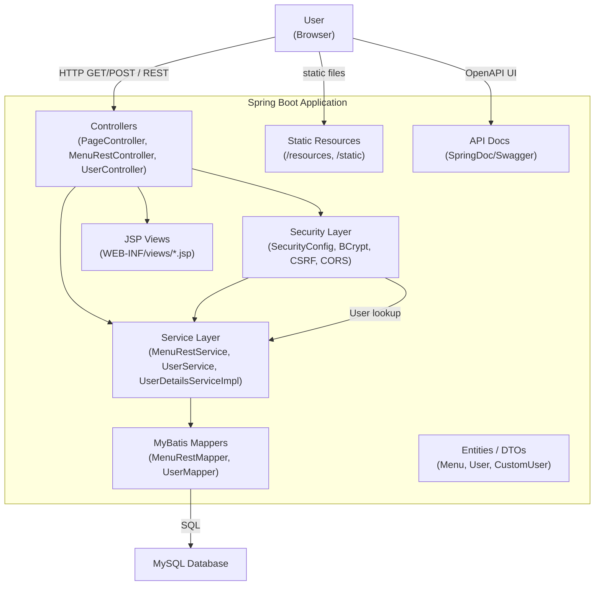
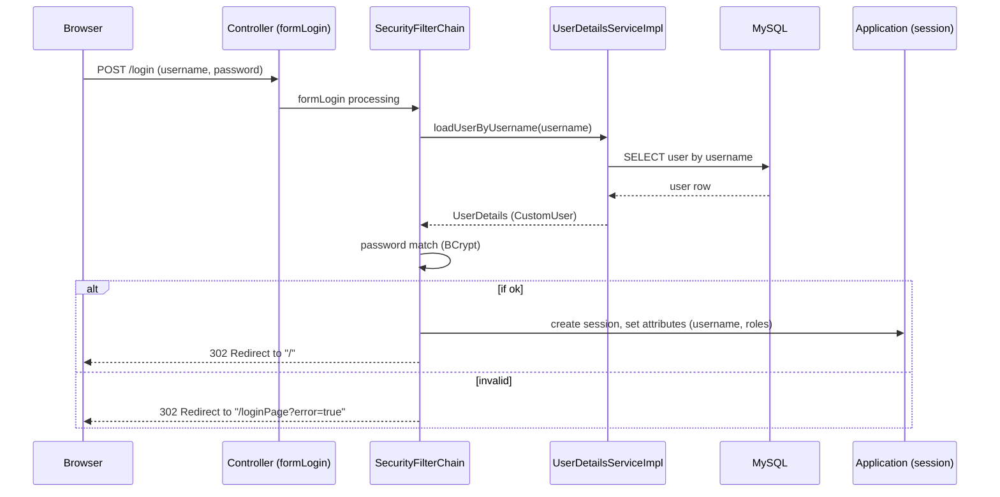
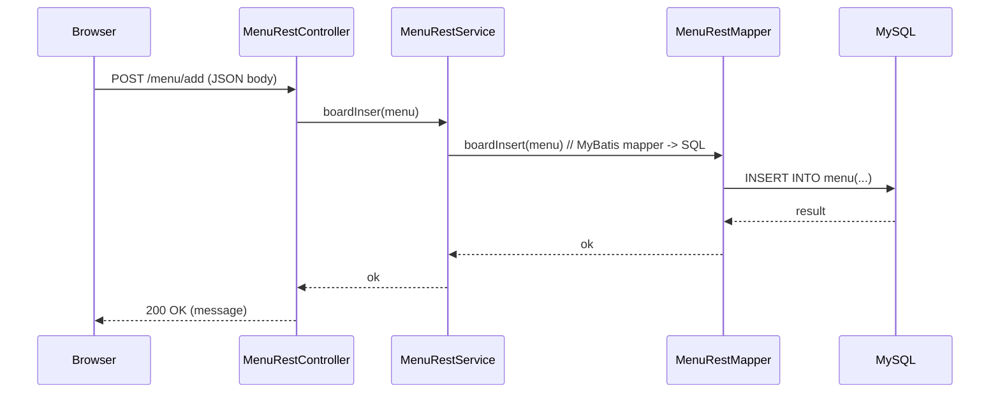

# 간이 게시판 (개인 프로젝트)

## ⚙ 개요
Spring Boot 기반의 서버 사이드 렌더링 웹 애플리케이션입니다. Java 17과 Gradle을 사용하여 개발했으며, 뷰는 JSP로 구성되어 있고 데이터 접근은 MyBatis를 통해 MySQL과 연동됩니다. 인증·인가에는 Spring Security를 사용하고 API 문서화는 SpringDoc(Swagger)을 적용했습니다.

  
  
  
  

## 🔧 기술 스택
- **OS:** Windows  
- **Language & Platform:** Java 17, Spring Boot 3.3.4, Spring MVC  
- **View:** JSP, JSTL  
- **Auth:** Spring Security, BCrypt  
- **DB & Access:** MySQL, MyBatis (Annotation 기반 Mapper)  
- **Build/Docs:** Gradle (Wrapper), SpringDoc (OpenAPI / Swagger UI)

## 📂 구조 개요 (Components)

### ✅ Client
- JSP 기반 서버 사이드 렌더링  
- 정적 리소스 제공  
- REST API 호출 기반 흐름 지원  

### ✅ Server (Spring Boot)

**Controllers**  
- `PageController`  
- `MenuRestController`  
- `UserController`  

**Services**  
- `MenuRestService`  
- `UserService`  
- `UserDetailsServiceImpl` (인증 처리)  

**Mappers (MyBatis)**  
- `MenuRestMapper`  
- `UserMapper`  

**Entities**  
- `Menu`  
- `User`  
- `CustomUser`  
- `Role`  

**Configurations**  
- `SecurityConfig` (CSRF, CORS, 권한/인증 설정)  
- `SwaggerConfig`  

**Views**  
- `/WEB-INF/views/*.jsp`  

**Database Tables**  
- menu
  - `id (PK)`
  - `title`
  - `content`
  - `created_at`
  - `view_count`

- user
  - `id (PK)`
  - `username`
  - `password (BCrypt 해시)`
  - `role`

## 🔄 주요 흐름

### 1. 로그인 프로세스
1. 사용자가 `POST /login` 요청 전송  
2. Spring Security 필터 체인에서 인증 처리  
3. `UserDetailsServiceImpl` → `UserMapper` 통해 DB 사용자 조회  
4. BCrypt로 비밀번호 검증  
5. 인증 성공 시 사용자 정보/권한을 세션에 저장  
6. 메인 페이지로 리다이렉트  

### 2. 회원가입
1. `POST /register` 요청  
2. 입력한 비밀번호를 BCrypt로 해시  
3. `UserService` → `UserMapper`를 통해 DB insert  

### 3. 게시글 작성 (REST)
1. 클라이언트가 `POST /menu/add` JSON 요청 전송  
2. `MenuRestController` → `MenuRestService` → `MenuRestMapper` 순으로 DB insert  
3. 작성일 자동 설정  
4. 조회수 초기 초기화 로직 처리

## 아키텍처 다이어그램 (Mermaid)

### 컴포넌트 다이어그램
(프로젝트 구조: Controller → Service → Mapper → DB, JSP 렌더링 흐름 기반)

### 시퀀스 다이어그램: 로그인
- User → `/login` 요청  
- Spring Security 인증  
- UserDetailsServiceImpl → UserMapper → DB 조회  
- 인증 성공 후 세션 저장 및 리다이렉트  

### 시퀀스 다이어그램: 게시글 작성 (REST)
- User → `/menu/add` 요청  
- Controller → Service → Mapper → DB insert  
- Response 반환 및 클라이언트 UI 갱신  

## 주요 파일 / 확인 포인트
- `build.gradle` : 의존성 및 플러그인
- `SpringProject1Application.java` : 애플리케이션 진입점
- `config/` : 보안 설정 및 기타 환경 설정
- `controller/` : 화면/API 엔드포인트
- `mapper/` : MyBatis 매퍼
- `webapp/WEB-INF/views/` : JSP 템플릿

## Swagger / API 문서

## 프로젝트 성과
- Spring Boot 기반 프로젝트 전체 흐름 이해  
- 사용자 인증 및 권한 구조(Spring Security) 학습  
- 서버사이드 렌더링(JSP) 기반 UI 개발 경험  
- Swagger(OpenAPI) 적용을 통해 API 문서화 구성  
- RESTful 구조와 MyBatis 매퍼 기반 CRUD 구현 학습
