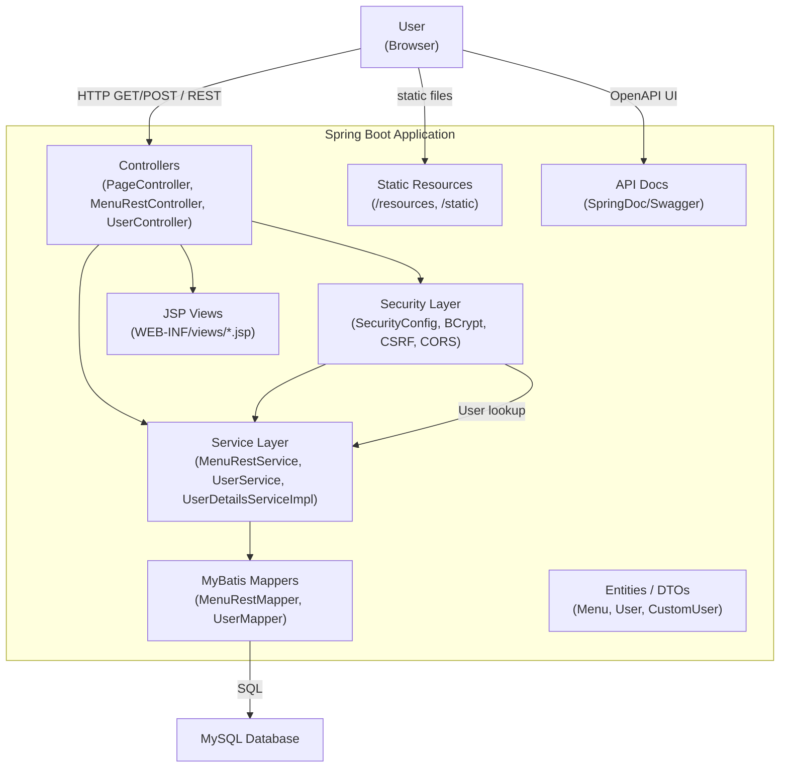
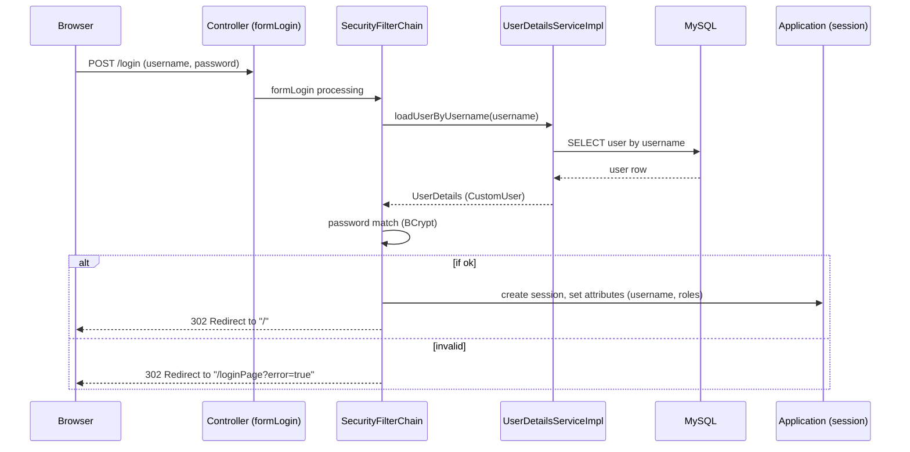
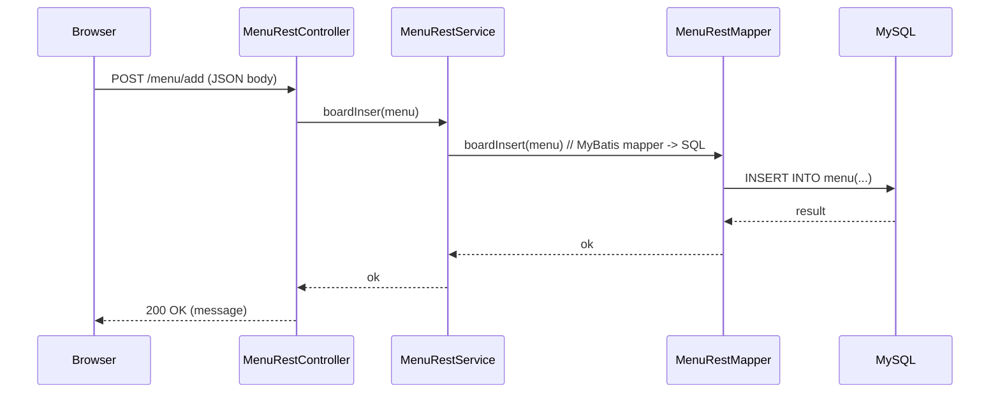

# 간이 게시판 (개인 프로젝트)

## 개요
Spring Boot 기반의 서버 사이드 렌더링 웹 애플리케이션입니다. Java 17과 Gradle을 사용하여 개발했으며, 뷰는 JSP로 구성되어 있고 데이터 접근은 MyBatis를 통해 MySQL과 연동됩니다. 인증·인가에는 Spring Security를 사용하고 API 문서화는 SpringDoc(Swagger)을 적용했습니다.

## 핵심 요약
- OS: window
- 플랫폼: Java 17
- 프레임워크: Spring Boot 3.3.4
- 뷰: JSP + JSTL
- DB 접근: MyBatis
- 인증/인가: Spring Security
- API 문서화: SpringDoc (Swagger UI)
- 빌드: Gradle (wrapper 포함)

## 상세 기술 스택
- Java 17
- Spring Boot 3.3.4
- spring-boot-starter-web (Spring MVC)
- spring-boot-starter-security
- mybatis-spring-boot-starter (MyBatis)
- org.springdoc:springdoc-openapi-starter-webmvc-ui
- jakarta.servlet / JSTL, tomcat-embed-jasper (JSP 지원)
- MySQL Connector (runtimeOnly)

## 프로젝트 구조 (주요 경로)
- `src/main/java/com/wt/spring_project1/`
  - `controller/` : HTTP 요청 처리
  - `service/`    : 비즈니스 로직
  - `mapper/`     : MyBatis 매퍼 인터페이스 및 매핑
  - `entity/`     : 도메인/엔티티 클래스
  - `config/`     : 보안 및 기타 설정
- `src/main/resources/application.properties` : 환경/DB 설정
- `src/main/webapp/WEB-INF/views/` : JSP 뷰 파일
- `src/main/webapp/resources/` : 정적 리소스(css, js)
- `build.gradle` : 빌드/의존성 정의

## 주요 기능
- 사용자 로그인 / 권한 관리 (Spring Security)
- CRUD 기반 게시판/공지사항 (JSP + MyBatis)
- API 문서 자동화 (SpringDoc / Swagger UI)
- 서버 사이드 렌더링 기반의 페이지 제공

## Swagger / API 문서

## 아키텍처 다이어그램 (Mermaid)

### 컴포넌트 다이어그램

### 시퀀스 다이어그램: 로그인

### 시퀀스 다이어그램: 게시글 작성 (REST)

## 주요 파일 / 확인 포인트
- `build.gradle` : 의존성 및 플러그인
- `SpringProject1Application.java` : 애플리케이션 진입점
- `config/` : 보안 설정 및 기타 환경 설정
- `controller/` : 화면/API 엔드포인트
- `mapper/` : MyBatis 매퍼
- `webapp/WEB-INF/views/` : JSP 템플릿
